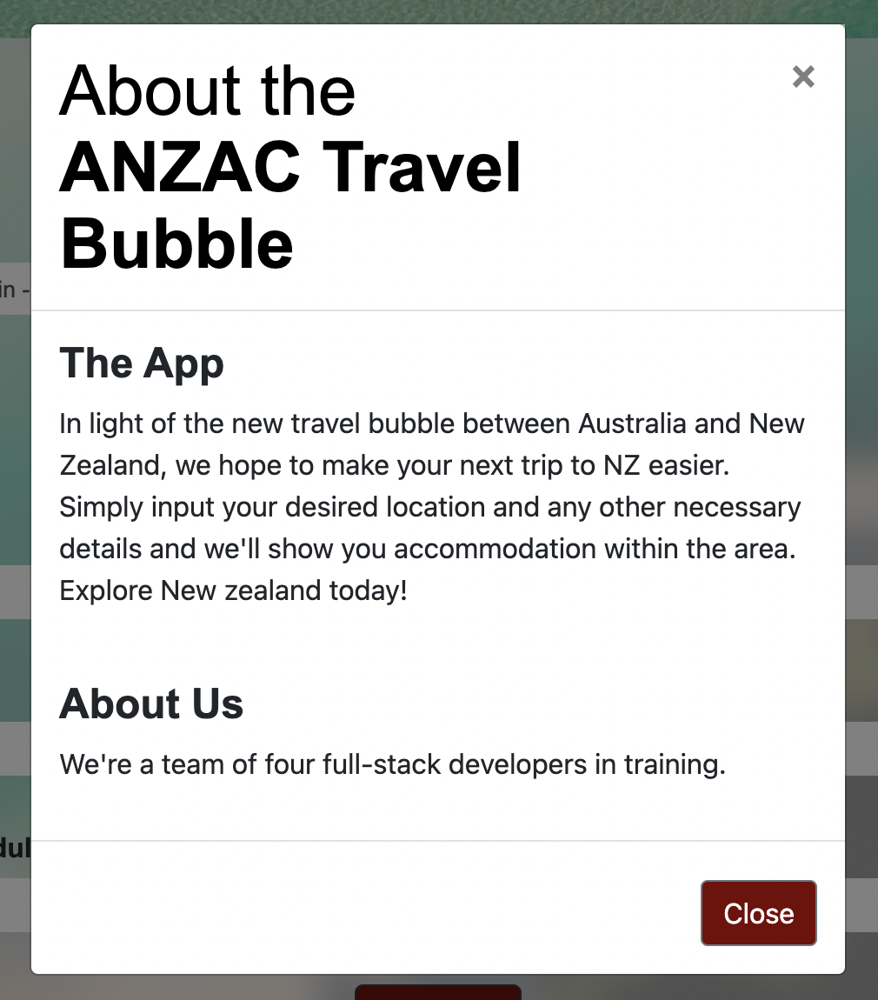
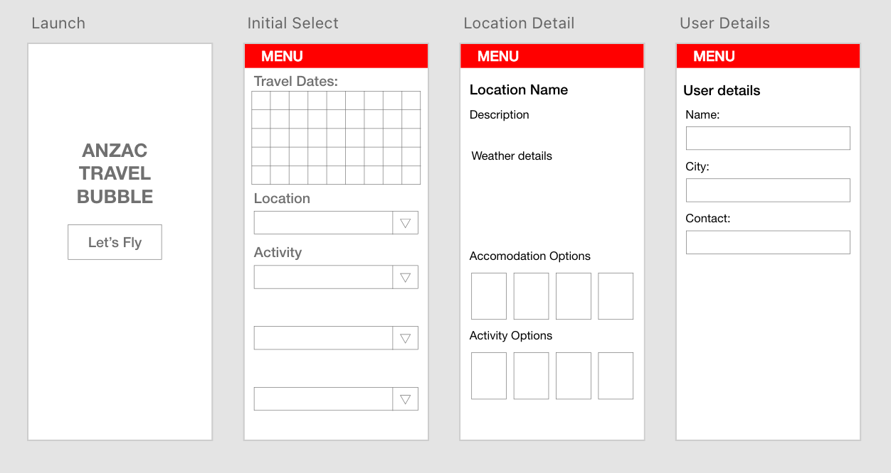
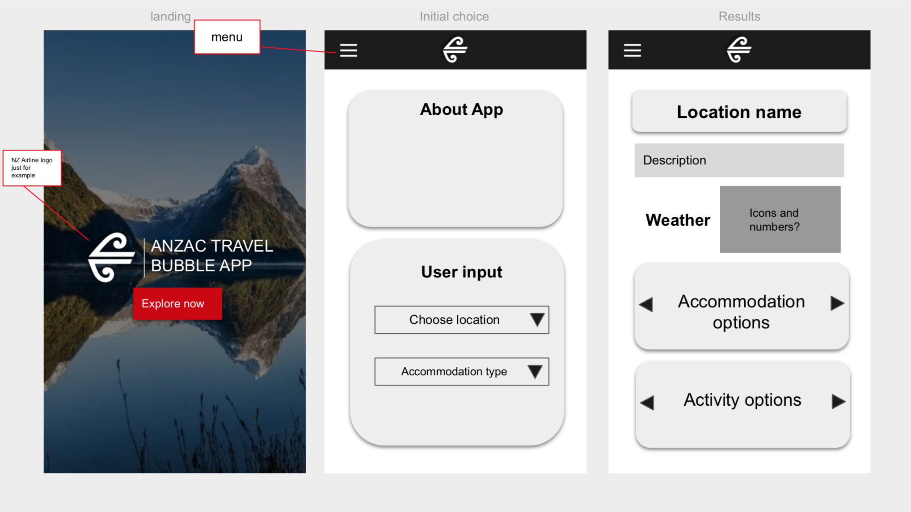
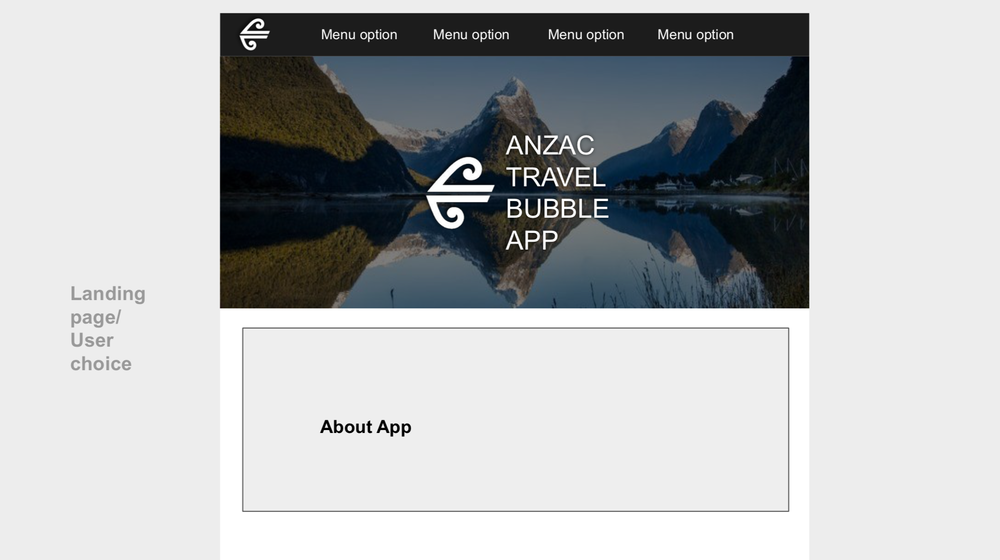
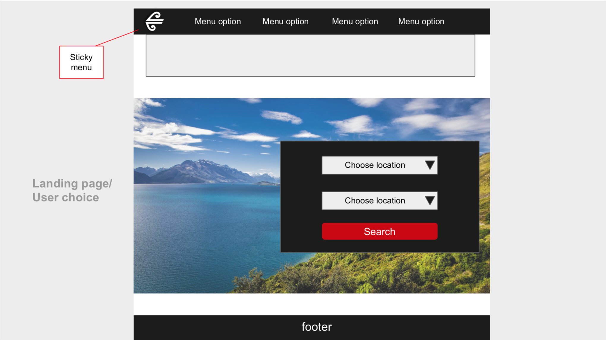
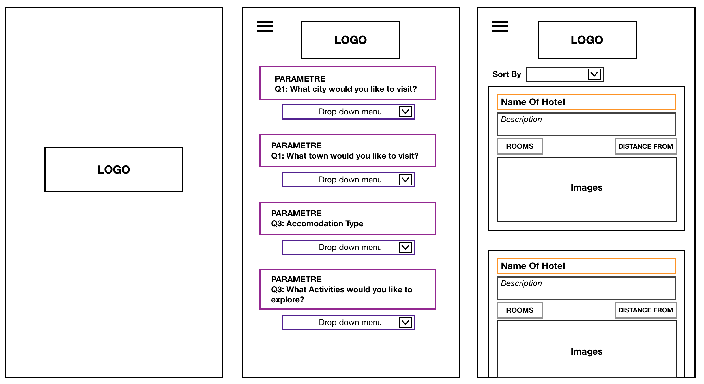

# The-ANZAC-Bubble-Travel-App

Welcome to The ANZAC Bubble Travel App!
In light of the new travel bubble between Australia and New Zealand, we hope to make your next trip to NZ easier. Simply input your desired location and any other necessary details and we'll show you accommodation within the area.

## Table of Content
- [About Us](#About-Us)
- [Our App](#Our-App)
    - [User Stories](#User-Stories)
    - [Functionality](#Functionality)
- [Process](#Process)
    - [Wireframe](#Wireframe)
    - [API](#API)
- [Deployed Site](#Deployed-Site)

## About Us
- [Ushante Lancaster](https://github.com/subwayaintfresh)
- [Sam Law](https://github.com/MrSamLaw) 
- [Tim Rabbidge](https://github.com/TBR2000)
- [Carly Jackson](https://github.com/caarlyjackson)

## Our App
The ANZAC Bubble Travel App is a dynamic, user friendly, and convenient travel and accomodation searcher for Australians that are keen to visit our New Zealand neighbours! The application provides each user with the option to search by a range of categories, including the prefered city they'd like to explore, the price range of their choosing and the number of adults traveling. Additionally, the app provides the keen traveller with the current weekly weather forecast of their chosen city, displaying a brief description, temperature reading, the average wind speed, humidity percentage and a cute weather icon for the day.

### User Stories
    Ollie, a young tourist from Melbourne, is keen to embark on his next adventure choosing to explore the vast landscape of New Zealand.  He's hoping to stay at a range of backpacker hostels with the option of spending a few nights in a holiday park or campground while he surfs Highway 45 and hikes the Pouakai Circuit.

    Amy, Roger & their 2 year old son Phillip have been looking forward to getting overseas for a while.  They’re looking to travel around a few places in New Zealand to see the sights, but also keep Phillip entertained.

    Suzannah and Tommy are planning their first getaway since lockdown  and plan to go camping. They want to be able to gauge the weather forecast in Wellington so they can plan for rainy days and the activities available in the given conditions.

### Functionality
The following displays our app's functionality.

- Landing and selection page

.gif)

-  Available accomodation

.gif)

- Responsive aspects

.gif)

## Process
For our travel app, we used the following technologies:
### Web APIs:

### Rapid API
Hotel API by APIDojo
https://rapidapi.com/apidojo/api/hotels4
### OpenWeather API
Call 5 day / 3 hour forecast data
https://openweathermap.org/api

### Bootstrap:
Modals, Hero/Landing Page, Error Messages...
### Exhibit A: About Us Modal

### JavaScript:
    if (hotels.length === 0) {
        hotelContainerEl.textContent = 'No hotels found.';
        return;
    }

    // appending cards for results
        for (var i = 0; i < hotels.length; i++) {

    var hotelCardEL = document.createElement('div');
        hotelCardEL.classList = 'card';
        hotelCardEL.setAttribute('style', 'width: 18rem');
        hotelContainerEl.appendChild(hotelCardEL);

### JQuery:
        var card = $("
").attr("class", "weather-card", "col-xs-4");

#### Moment JS
        var date = $("<h5>").text(moment.unix(filteredForecast[i].dt).format('L')).attr("class", "date");

## Wireframe
Initial Wireframes:

# Deployed Site
https://caarlyjackson.github.io/The-ANZAC-Bubble-Travel-App/ 
